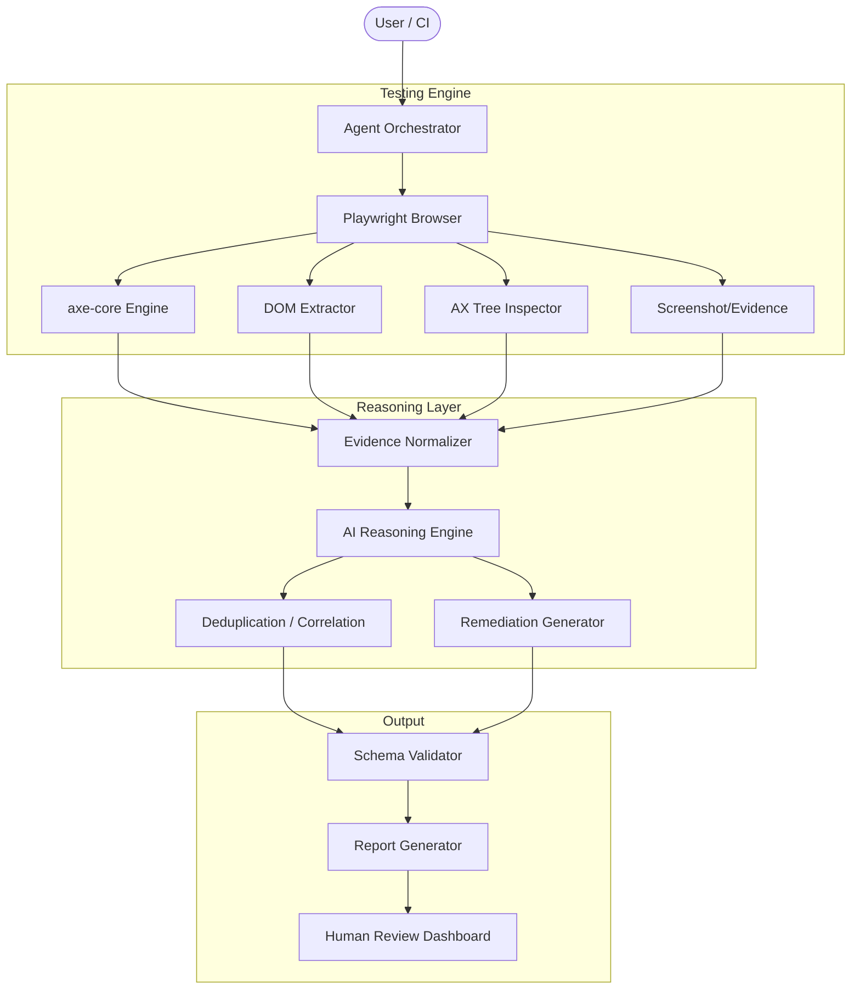

# AI Accessibility Testing Agent - Architecture & Implementation Plan

## 1. Executive Architecture
The system is a deterministic-first, AI-assisted accessibility testing platform. It uses Playwright for browser automation, axe-core for deterministic WCAG violation detection, and an LLM-based Agentic loop to orchestrate interactions, analyze the accessibility tree, aggregate evidence, perform root-cause analysis, and generate remediation guidance. It explicitly decouples detection (deterministic) from reasoning (AI).

## 2. Detailed Architecture Diagram


## 3. Component Responsibilities
- **Agent Orchestrator:** Manages the observe-plan-act loop, applying a step limit to prevent infinite loops. Invokes tools securely.
- **Playwright Controller:** Wraps browser actions, ensuring page stabilization, injecting deterministic scripts, and capturing state.
- **Testing Modules (axe, keyboard, focus):** Run specific accessibility checks. Axe for DOM-based static rules; keyboard for tab-order tracking.
- **Evidence Collector:** Gathers screenshots, bounding boxes, DOM snippets, and AX tree dumps for every state change or finding.
- **AI Reasoner:** Takes deterministic findings and evidence, maps them to root causes, generates developer fixes, and flags ambiguous items for manual review.
- **Schema Validator:** Ensures all findings conform strictly to the required JSON schema.

## 4. Technology Selection
- **Core Language:** Python 3.11+
- **Browser Automation:** Playwright for Python (async support, deep CDP access, robust waiting mechanisms).
- **Deterministic Engine:** `axe-core` (injected via Playwright).
- **AI Model:** Gemini 1.5 Pro / GPT-4o level model for deep reasoning and multimodal vision capabilities (for screenshots).
- **Data Validation:** Pydantic (for strict JSON schema enforcement of findings).
- **Reporting:** Jinja2 for HTML reporting, standard JSON outputs.

## 5. Why Each Technology Was Selected
- *Playwright:* Superior to Selenium for modern SPAs; native accessibility tree snapshot support.
- *axe-core:* The undisputed industry standard for deterministic a11y testing. Avoids reinventing the wheel for standard WCAG checks.
- *Pydantic:* Critical for Phase 9 to guarantee the LLM does not hallucinate arbitrary data structures.

## 6. Alternative Technologies Considered
- *Puppeteer:* Rejected in favor of Playwright due to Playwright's better cross-browser support and native async Python bindings.
- *LLM-only detection:* Rejected (Phase 24) due to unacceptable false positive rates and inability to reliably parse deep DOM properties mathematically.

## 7. End-to-End Execution Flow
1. **Initialize:** Orchestrator receives URL and configuration.
2. **Navigate:** Playwright loads URL, waits for network idle.
3. **Scan (Base State):** Injects axe-core, captures base accessibility tree and screenshots.
4. **Interact (Agent Loop):** Agent identifies interactive elements (buttons, links). Uses tools to `press_key("Tab")` or `click()`.
5. **Re-Scan (New State):** Captures state after interaction (e.g., modal opens). Runs axe-core again.
6. **Analyze:** Agent passes axe findings and evidence to LLM to formulate root causes and remediations.
7. **Consolidate:** Deduplicates findings based on component signatures.
8. **Report:** Generates strict JSON schema and human-readable HTML report.

## 8. Agent/Tool Architecture
The AI will be provided a strict toolset:
- `navigate(url)`
- `run_deterministic_scan()`
- `get_accessibility_tree()`
- `press_key(key)`
- `click_element(selector)`
- `capture_evidence(element_id)`
- `evaluate_finding(evidence_package)`

## 9. WCAG Testing Strategy
- **Levels:** A and AA (WCAG 2.2).
- **Mapping:** Findings are mapped to standard criteria (e.g., 1.1.1 Non-text Content, 2.1.1 Keyboard).
- **Confidence:** Axe findings are `CONFIRMED`. Visual/semantic anomalies flagged by AI are `REQUIRES_MANUAL_REVIEW`.

## 10. Evidence Strategy
Every finding JSON must contain an `evidence` array containing:
- Target DOM snippet (outer HTML).
- Bounding box coordinates.
- Timestamp & URL state.
- Base64 Screenshot or reference to local file.
- AX Tree node representation.

## 11. Finding JSON Schema (Pydantic / Draft-7)
```json
{
  "finding_id": "A11Y-UUID",
  "url": "...",
  "element": {
    "role": "button",
    "accessible_name": "Submit",
    "selector": "#btn-1",
    "html": "<button id='btn-1'></button>"
  },
  "classification": {
    "status": "confirmed",
    "detection_method": "automated",
    "confidence": 1.0
  },
  "wcag": {
    "version": "2.2",
    "success_criterion": "1.1.1",
    "level": "A"
  },
  "description": "...",
  "root_cause": "...",
  "recommendation": "..."
}
```

## 12. Evaluation Strategy
- Construct a test corpus of 20 static HTML pages with known WCAG passes and failures.
- Run the agent against the corpus.
- Calculate Precision (True Positives / (True Positives + False Positives)) and Recall (True Positives / (True Positives + False Negatives)).
- Target: 100% recall on deterministic failures, < 5% false positive rate on AI reasoning.

## 13. Repository Structure
```text
accessibility-agent/
├── agent/                # Orchestrator, memory, tools
├── accessibility/        # axe-core bindings, Playwright wrappers
├── wcag/                 # Criteria mappings, Pydantic schemas
├── evidence/             # Screenshot and DOM capture utilities
├── reporting/            # HTML/JSON generators
├── tests/                # Unit/Integration and Corpus tests
└── config/               # Prompts, thresholds, browser configs
```

## 14. Security Model
- Playwright context runs isolated.
- Agent prompts explicitly instruct not to expose cookies/tokens in LLM outputs.
- Redaction step strips PII/Authorization headers from network logs and HTML dumps before sending to the LLM.

## 15. Risks and Limitations
- **Screen Reader Parity:** AX Tree analysis is not a 100% guarantee of screen reader behavior (e.g., JAWS heuristics differ from strict AX tree).
- **Execution Speed:** AI-assisted state exploration is significantly slower than standard headless unit tests.
- **Tokens:** High DOM complexity can easily exceed context windows. DOM minification/pruning is required.

## 16. Development Phases
- **0.1:** Core Playwright + axe-core integration (deterministic only).
- **0.2:** Evidence collection (DOM, screenshots) and Deduplication.
- **0.3:** Keyboard interaction engine (Tab tracking, focus visibility).
- **0.4:** AI Reasoning layer (root cause, remediation) using strict JSON.
- **0.5:** Autonomous Agent Loop (Observe, Plan, Act) for state exploration.
- **1.0:** Evaluation suite, Reporting dashboard, and open-sourcing.

## 17. MVP Scope (v0.1 - v0.4)
Scan a given URL, run deterministic rules, automatically capture visual and DOM evidence, and generate an AI-enhanced report containing root causes and developer remediations for those deterministic findings.

## 18. Future Scope (v0.5+)
Full autonomous crawling of SPAs, authenticated state exploration, dynamic modal testing, and integration with actual screen reader text-to-speech outputs via specialized VMs.

## 19. Research References
- W3C WCAG 2.2 Specifications
- W3C ACT (Accessibility Conformance Testing) Rules Format
- ARIA Authoring Practices Guide (APG)
- axe-core API documentation
- Playwright Accessibility API

## 20. Step-by-Step Implementation Plan (Next Steps)
1. **Initialize Project:** Create repository structure and `pyproject.toml`.
2. **Implement Schemas:** Define Pydantic models for `Finding`, `Evidence`, and `WCAG`.
3. **Core Browser Wrapper:** Build the Playwright `AccessibilityBrowser` class to handle navigation and axe-core injection.
4. **Tool Definitions:** Expose browser methods as AI tools.
5. **Agent Loop:** Implement the `Observe -> Act -> Validate` loop.
6. **Reporting:** Build the JSON and HTML output generation.
7. **Test Corpus:** Create the initial set of known-failing HTML fixtures.
8. **Evaluation:** Run the agent against the fixtures and tune prompts to eliminate false positives.

## User Review Required
> [!IMPORTANT]
> The architectural decision to completely rely on `axe-core` for deterministic checks, and strictly restrict the LLM to reasoning and state-exploration (rather than detection), is the core design philosophy to prevent false positives. Please confirm this alignment before implementation begins.
